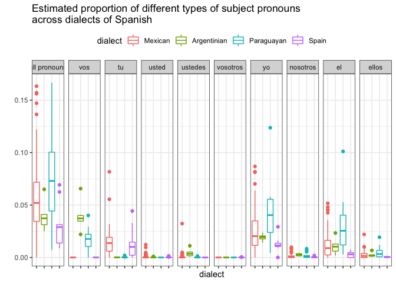
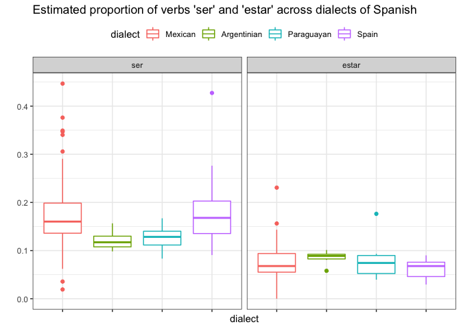
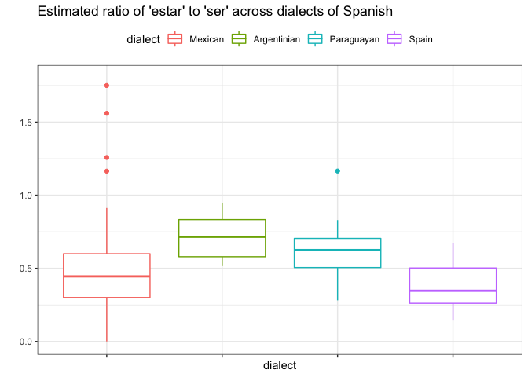
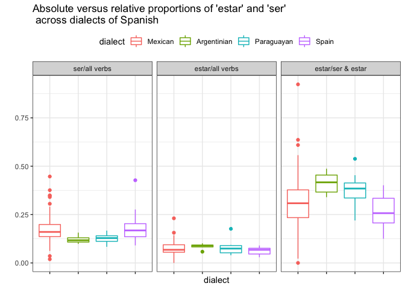

Project proposal for Data Incubator
================

available at: <https://github.com/HannahForsythe/span_dialects> author:
Hannah Forsythe date: 13-April-2020 description: Exploratory analysis of
dialectal differences across Spanish. Figure 1 explores the utility of
two potential features for characterizing dialectal differences: (i)
overall rates subject pronoun use, and (ii) rates of different types of
subject pronouns Figure 2 explores the utility of a using the ratio of
similar meaning verbs ‘estar’ and ‘ser’ (‘be’) to distinguish between
dialects. Figure 3 extends this to other pairs of similar meaning words.

future goals: use these insights to produce a classifier capable of
identifying a dialect, given an utterance of reasonable length.

potential application: allow an ASR (Alexa, Siri, etc.) to detect when a
different dialect is being spoken than expected, so it can prompt the
user to change settings. (For example, when set to Mexican Spanish, the
ASR should be able to detect the use of Spanish with non-Mexican
features).

``` r
####################
#libraries
####################
library(dplyr)
```

    ## 
    ## Attaching package: 'dplyr'

    ## The following objects are masked from 'package:stats':
    ## 
    ##     filter, lag

    ## The following objects are masked from 'package:base':
    ## 
    ##     intersect, setdiff, setequal, union

``` r
library(plyr)
```

    ## -------------------------------------------------------------------------

    ## You have loaded plyr after dplyr - this is likely to cause problems.
    ## If you need functions from both plyr and dplyr, please load plyr first, then dplyr:
    ## library(plyr); library(dplyr)

    ## -------------------------------------------------------------------------

    ## 
    ## Attaching package: 'plyr'

    ## The following objects are masked from 'package:dplyr':
    ## 
    ##     arrange, count, desc, failwith, id, mutate, rename, summarise,
    ##     summarize

``` r
library(pryr)
library(ggplot2)
library(stringr)
library(lme4)
```

    ## Loading required package: Matrix

``` r
library(reshape)
```

    ## 
    ## Attaching package: 'reshape'

    ## The following object is masked from 'package:Matrix':
    ## 
    ##     expand

    ## The following objects are masked from 'package:plyr':
    ## 
    ##     rename, round_any

    ## The following object is masked from 'package:dplyr':
    ## 
    ##     rename

``` r
library(readr)
```

Data: The data for this exploratory analysis comes from transcripts of
free-form parent-child interactions in 4 different dialects, compiled
from 6 corpora available at
<https://childes.talkbank.org/access/Spanish/> and 2 private corpora
(anticipated release: Sept. 2020). Each utterance has been tagged for
speaker and the words have been passed through the part-of-speech tagger
designed for Spanish by Brian MacWhinney and described here:
<https://talkbank.org/manuals/MOR.pdf> . An important feature of this
tagger is that it identifies verb stems (ex. esta-) so that different
inflections of the same verb (ex. estoy, ‘(I) am’, estás ‘(you) are’,
etc.) can be easily grouped together. I have used the accompanying free
software called CLAN (<http://dali.talkbank.org/clan/>) to put the data
into csv format, with one line per utterance.

The code below cleans the data and extract the following variables: a)
file: name of the transcript b) line: each utterance appears on a
separate line c) participant: what kind of person is speaking (parent,
investigator, etc.) For now, we only include adults; no children. d)
speaker: the speaker’s unique ID e) environment: the utterance,
including all the words that were said and the part-of-speech tags f)
dyad: this variable is used to identify some mother-child pairs g)
dialect: For now, this includes Mexican, Argentinian, Spain, and
Paraguayan Spanish.

``` r
################
#Data prep - Schmitt Miller corpus (Mexico City - 24 children, approx 60 adults )
###############
#citation: Forsythe, H., D. Greeson and C. Schmitt (to appear). "How preschoolers acquire the null-overt contrast in Mexican Spanish: Evidence from production," Colomina-Almiñana, J. & S. Sessarego (eds.). Patterns in Spanish: Structure, Context and Development. Amsterdam/Philadelphia: John Benjamins. 
#link to paper: https://hannahforsythe.weebly.com/uploads/3/0/9/7/30974925/frosytheetal-2019-hlsproceedings-revised.pdf
#This data is private, pending anonymization

schmill <- read_delim("SchmittMiller/allSchmittMiller-all.csv", '\t', col_names=c("file", "language", "corpus", "participant", "age", "sex", "empty1", "empty2", "role", "empty3", "empty4", "line", "token", "environment"))

#remove duplicate rows
schmill <- distinct(schmill)

#check participant codes
levels(as.factor(schmill$participant))

#As with the other files, select only adult speech
CDMX1 <- schmill %>% filter(participant %in% c("ADU", "FAT", "FRI", "LAD", "MOM", "MOT", "OTH", "OTH1", "SIS", "SP01", "TEA", "WOM")) %>% 
  select(file, line, participant, environment)
#assign dialect variable:
CDMX1$dialect <- as.factor("Mexican")

#assign speaker variable: 
  #extract child code from first three characters of filename and use it to make the speaker ID
  CDMX1$speaker <- str_extract(CDMX1$file, "[A-Z][A-Z][A-Z]")
  #concatenate with participant code to make the speaker ID
  CDMX1$speaker <- as.factor(paste0(CDMX1$participant, "-", CDMX1$speaker))

################
#Data prep - Villa21 corpus (mixed Paraguayan/Argentinian Spanish, 9 children, 12 adults)
################
#citation: This data is private for the moment
LI <- read.csv("Villa21/nullovert123-Lucero-grk.csv")
LI$dyad <- as.factor("LI")

ODOG <- read.csv("Villa21/nullovert123-Oscar-grk.csv")
ODOG$dyad <- as.factor("ODOG")

AG <- read.csv("Villa21/nullovert123-Araceli-hcf.csv")
AG$dyad <- as.factor("AG")

GG <- read.csv("Villa21/nullovert123-Gaston-hcf.csv")
GG$dyad <- as.factor("GG")

AC <- read.csv("Villa21/nullovert123-Angel-hcf.csv")
AC$dyad <- as.factor("AC")

BB <- read.csv("Villa21/nullovert123-Barbara-hcf.csv")
BB$dyad <- as.factor("BB")

DDZF <- read.csv("Villa21/nullovert123-Dante-hcf.csv")
DDZF$dyad <- as.factor("DDZF")

ABB <- read.csv("Villa21/nullovert123-Alexandra-hcf.csv")
ABB$dyad <- as.factor("ABB")

EGC <- read.csv("Villa21/nullovert123-Elias-hcf.csv")
EGC$dyad <- as.factor("EGC")

Villa21 <- rbind.fill(AG, ABB, EGC, GG, AC, BB, LI, DDZF, ODOG)

#replace the problematic column names
names(Villa21) <- revalue(names(Villa21), c("."="empty", "..1"="empty1", "..2"="empty2", "..3"="empty3"))

####NOTE:
####parents in this corpus speak Paraguayan Spanish, investigators speak Argentinian Spanish, and kids speak a mix
####speaker is coded differently for investigators, so we will prepare data SEPARATELY for each dialect  

#As with the other files, select only adult speech main lines (no comments or grammatical codes)
PS <- Villa21 %>% filter(participant %in% c("MOT", "MOT2", "FAT") & tier %in% "%mor:") %>% 
  select(file, line, participant, environment, dyad)
  #assign dialect variable:
  PS$dialect <- as.factor("Paraguayan")
  #assign speaker variable
  PS$speaker <- as.factor(paste0(PS$participant, "-", PS$dyad))

ArgS <- Villa21 %>% filter(participant %in% c("INV") & tier %in% "%mor:") %>% 
  select(file, line, participant, environment, dyad)
  #assign dialect variable:
  ArgS$dialect <- as.factor("Argentinian")
  #assign speaker variable: Detect which investigator code appears in the filename and use it as speaker ID
    inv_codes <- c("-EB|-SDS|-MDLR|-ALC|-MMU|-MM")
    ArgS$speaker <- as.factor(str_extract(ArgS$file, inv_codes))
    #drop lines where filename improperly left out the investigator code
    ArgS <- subset(ArgS, !is.na(ArgS$speaker))
    #correct improper tag -MM to -MMU
    ArgS$speaker <- revalue(ArgS$speaker, c("-MM"="-MMU"))
    #concatenate with participant code, to be formatted like the other speaker IDs
    ArgS$speaker <- as.factor(paste0(ArgS$participant, ArgS$speaker))

    
################
#Data prep - Diez Itza corpus (Spain (Oviedo) - 2 adult speakers, 20 children)
################
#citation: Diez-Itza, E. (1995). Procesos fonológicos en la adquisición del español como lengua materna. In J.M. Ruiz, P. Sheerin, & E. González-Cascos (Eds.), Actas del XI Congreso Nacional de Linguistica Aplicada. Valladolid:Universidad de Valladolid.
#https://childes.talkbank.org/access/Spanish/DiezItza.html
  
diezitza <-read.csv("DiezItza/DiezItza_all.csv")

#As with the other files, select only adult speech main lines (no comments or grammatical codes)
Spain1 <- diezitza %>% filter(participant %in% c("MOT", "INV") & tier %in% "%mor:") %>% 
  select(file, line, participant, environment)
  #assign dialect variable:
  Spain1$dialect <- as.factor("Spain")
  #assign speaker variables
  Spain1$speaker <- as.factor(paste0(Spain1$participant, "-DZIZ"))
      
################
#Data prep - Linaza corpus (Spain (Madrid) - 2 adult speakers, 1 child)
################
#citation: Linaza, J., Sebastián, M. E., & del Barrio, C. (1981). Lenguaje, comunicación y comprensión. La adquisición del lenguaje. Monografía de Infancia y Aprendizaje, 195-198.
#https://childes.talkbank.org/access/Spanish/Linaza.html
  linaza <-read.csv("Linaza/Linaza_all.csv")
  #check participant codes
  levels(linaza$participant)
  
  #As with the other files, select only adult speech main lines (no comments or grammatical codes)
  Spain2 <- linaza %>% filter(participant %in% c("ADU", "ANA", "CUI", "MAD", "PAD") & tier %in% "%mor:") %>% 
    select(file, line, participant, environment)
  #assign dialect variable:
  Spain2$dialect <- as.factor("Spain")
  #assign speaker variables
  Spain2$speaker <- as.factor(paste0(Spain2$participant, "-LIN"))
  
################
#Data prep - OreaPine corpus (Spain (Madrid) - 2 adult speakers, 2 children)
################
#citation: Aguado-Orea, J., & Pine, J. M. (2015). Comparing different models of the development of verb inflection in early child Spanish. PloS one, 10(3), e0119613.
#https://childes.talkbank.org/access/Spanish/OreaPine.html
#prep each kid separately, so "FAT" and "MOT" participants can be identified as different speakers
  
  #####Lucia
  lucia <- read.csv("OreaPine/Lucia/OreaPine-Lucia.csv")
  
  #check participant codes
  levels(lucia$participant)
  
  #As with the other files, select only adult speech main lines (no comments or grammatical codes)
  lucia <- lucia %>% filter(participant %in% c("FAT", "MOT") & tier %in% "%mor:") %>% 
    select(file, line, participant, environment)
  #assign dialect variable:
  lucia$dialect <- as.factor("Spain")
  #assign speaker variables
  lucia$speaker <- as.factor(paste0(lucia$participant, "-LUC"))
  
  #####Juan
  #Juan has 2 files, neither with headers. read them in with headers and combine
  juan1 <- read_delim("OreaPine/Juan/OreaPine-Juan011021_020207.csv", ',', col_names=c("file", "language", "corpus", "participant", "age", "sex", "empty1", "empty2", "role", "empty3", "empty4", "line", "token", "environment"))
  juan2 <- read_delim("OreaPine/Juan/OreaPine-Juan020211_020529b.csv", ',', col_names=c("file", "language", "corpus", "participant", "age", "sex", "empty1", "empty2", "role", "empty3", "empty4", "line", "token", "environment"))
  juan12 <- rbind(juan1, juan2)
  
  #Juan files have duplicate rows; remove them
  juan12 <- distinct(juan12)
  
  #check participant codes
  levels(as.factor(juan12$participant))
  
  #As with the other files, select only adult speech
  juan <- juan12 %>% filter(participant %in% c("FAT", "MOT", "AB2", "ABU", "TI1", "TI2", "TI3", "VEC")) %>% 
    select(file, line, participant, environment)
  #assign dialect variable:
  juan$dialect <- as.factor("Spain")
  #assign speaker variables
  juan$speaker <- as.factor(paste0(juan$participant, "-JUA"))
  
  ######Juan and Lucia
  #join kids into a single dataframe
  Spain3 <- rbind(lucia, juan)
  
################
#Data prep - FernAguado corpus (Spain (Pamplona) - 40 adult speakers, 40 children)
################
#citation: not given
#https://childes.talkbank.org/access/Spanish/FernAguado.html
  
  fernaguado <-read_delim("FernAguado/allFernAguado.csv", '\t', col_names=c("file", "language", "corpus", "participant", "age", "sex", "empty1", "empty2", "role", "empty3", "empty4", "line", "token", "environment"))
  
  #fernaguado files have duplicate rows; remove them
  fernaguado <- distinct(fernaguado)
  
  #check participant codes
  levels(as.factor(fernaguado$participant))
  
  #As with the other files, select only adult speech
  Spain4 <- fernaguado %>% filter(participant %in% c("FAT", "MOT", "INV")) %>% 
    select(file, line, participant, environment)
  #assign dialect variable:
  Spain4$dialect <- as.factor("Spain")
  
  #assign speaker variable: 
    #extract child name from beginning of filename and use it to make the speaker ID
    Spain4$speaker <- as.factor(str_extract(Spain4$file, "[:alpha:]+"))
    #concatenate with participant code to make the speaker ID
    Spain4$speaker <- as.factor(paste0(Spain4$participant, Spain4$speaker))
  
################
#Data prep - Remedi corpus (Argentinian Spanish from Córdoba - 1 adult speaker, 1 child)
################
#citation: not given
#https://childes.talkbank.org/access/Spanish/Remedi.html
    
remedi <- read.csv("Remedi/Remedi.csv", header=FALSE)
                   
names(remedi) <- c("file", "language", "corpus", "participant", "age", "sex", "empty1", "SES", "role", "empty3", "empty4", "line", "token", "environment")
    
#remedi files have duplicate rows; remove them
remedi <- distinct(remedi)

#check participant codes
levels(as.factor(remedi$participant))

#As with the other files, select only adult speech
ArgS2 <- remedi %>% filter(participant %in% c("PAD", "ALE")) %>% 
  select(file, line, participant, environment)
#assign dialect variable:
ArgS2$dialect <- as.factor("Argentinian")

#assign speaker variable: 
  #change participant codes to reflect their roles
  ArgS2$participant <- revalue(ArgS2$participant, c("PAD"="FAT", "ALE"="MOT"))
  #concatenate participant code with child's code to make the speaker ID
  ArgS2$speaker <- as.factor(paste0(ArgS2$participant, "-Vicky"))
    
################
#Data prep - Jackson Thal corpus (Mexican Spanish from Querétaro and Mexico City - 
################
#citation: Jackson-Maldonado, D. & Thal, D. (1993). Lenguaje y Cognición en los Primeros Años de Vida. Project funded by the John D. and Catherine T. MacArthur Foundation and CONACYT, Mexico
#https://childes.talkbank.org/access/Spanish/JacksonThal.html
#Note: missing a lot of accents. Will undercount tú and está.
  
  jacksonthal_mex <- read_delim("JacksonThal/JacksonThal_mex.csv", '\t', col_names=c("file", "language", "corpus", "participant", "age", "sex", "empty1", "empty2", "role", "empty3", "empty4", "line", "token", "environment"))

  #remove duplicate rows
  jacksonthal_mex <- distinct(jacksonthal_mex)
  #check participant codes
  levels(as.factor(jacksonthal_mex$participant))
  #As with the other files, select only adult speech
  jtmx <- jacksonthal_mex %>% filter(participant %in% c("FAT", "PAR", "TEA", "INV")) %>% 
    select(file, line, participant, environment)
  #assign dialect variable:
  jtmx$dialect <- as.factor("Mexican")
  #assign speaker variable: 
    #for investigators, grab alphanumerics from the filename, after the "-"
    #for everyone else, grab alphanumerics from the filename, before the "-"
    jtmx$speaker <- ifelse(jtmx$participant=="INV", str_extract(jtmx$file, "(?<=\\-)[:alnum:]+")
                            , str_extract(jtmx$file, "[:alnum:]+(?=\\-)"))
    #concatenate speaker variable with participant variable so it has the right format.
    jtmx$speaker <- as.factor(paste0(jtmx$participant, "-", jtmx$speaker))
    
  #Separate Queretaro and Mexico City dialects, just in case you want to exclude one of them later.
    #Note: Queretaro files have a 'q' in them and Mexico City have an 'm'
    CDMX2 <- subset(jtmx, str_detect(jtmx$file, "m"))
    QUER <- subset(jtmx, str_detect(jtmx$file, "q"))
```

After removing speakers with fewer than 100 utterances, the total size
of this dataset is 198,256 utterances, or 36.6 MB.

``` r
################
#primary dataset
################
#combine all dialects into one df
df <- rbind.fill(CDMX1, ArgS, PS,  Spain1, Spain2, Spain3, ArgS2, CDMX2, QUER)
  
#include only the talkative speakers (>=100 utterances)
  spkrs <- ddply(df, .(speaker), summarise, utterances = length(environment)) 
  loud_ones <- spkrs$speaker[spkrs$utterances>=100]
  df <- df %>% filter(speaker %in% loud_ones)
  
#measure size in rows and MB
nrow(df)  
```

    ## [1] 198256

``` r
object_size(df)
```

    ## 36.6 MB

The first feature we explore is the proportion of verbs with pronouns as
subjects. This rate varies systematically across different dialects,
with higher rates in contact dialects (ex. Paraguayan Spanish) and in
the Caribbean (not represented in our sample). We will also break these
rates down by individual pronoun, since some dialects use differnt
pronouns (ex. Paraguayans & Argentinians use ‘vos’ while Mexicans &
Spaniards use ‘tú’) and some dialects use the same pronouns to different
extents (ex. Spaniards are very informal so they probably never use
‘usted’).

``` r
################
#rate of pronominal subjects
################
    
#Define pronoun strings to search for in each line.
  #'vos' (sometimes also written as 'vo(s)' )
  vos <- c(" vos | vo\\(s\\) ")
  #'tú'
  tu <- c(" tú ")
  #'usted/ustedes' (sometimes also written as 'ustede(s)')
  usted <- c(" usted ")
  #'ustedes' (sometimes also written as 'ustede(s)')
  ustedes <- c(" ustedes | usted\\(s\\) ")
  #'vosotros' (sometimes also written as 'vosotro(s)')
  vosotros <- c(" vosotros | vosotro\\(s\\) ")
  #'yo'
  yo <- c(" yo ")
  #'nosotros/as'
  nosotros <- c(" nosotr")
  #él/ella
  el <- c(" él | ella ")
  #ellos/ellas (also include 'ello(s) and ella(s)')
  ellos <- c(" ellos | ellas | ello\\(s\\) | ella\\(s\\) ")
  
  #For each pronoun, define a variable counting its occurrences in each line . 
  #Note: Ideally I would find some way to do this for any arbritrary vector of words.
  
  df$vos <- str_count(df$environment, vos)
  df$tu <- str_count(df$environment, tu)
  df$usted <- str_count(df$environment, usted)
  df$ustedes <- str_count(df$environment, ustedes)
  df$vosotros <- str_count(df$environment, vosotros)
  df$yo <- str_count(df$environment, yo)
  df$nosotros <- str_count(df$environment, nosotros)
  df$el <- str_count(df$environment, el)
  df$ellos <- str_count(df$environment, ellos)
  
#Define a variable summing over all pronoun types
  df$pronoun_count <- rowSums(df[-c(1:8)])

#For the denominator, count how many verb tags are in each ine
  verbtag <- c(" v\\|| aux\\|| cop\\|")
  df$verb_count <- str_count(df$environment, verbtag)
  
#eliminate lines without verbs in them
  verbs <- subset(df, df$verb_count>0)

#For each speaker and dialect, get the proportion of each kind of pronoun. 
  #(This is a proxy for the proportion of verbs that have these pronouns as subjects.)
  dialect_pro <- ddply(verbs, .(dialect, speaker), summarise, 
                       pronoun_prop=mean(pronoun_count/verb_count),
                       vos_prop=mean(vos/verb_count),
                       tu_prop=mean(tu/verb_count),
                       usted_prop=mean(usted/verb_count),
                       ustedes_prop=mean(ustedes/verb_count),
                       vosotros_prop=mean(vosotros/verb_count),
                       yo_prop=mean(yo/verb_count),
                       nosotros_prop=mean(nosotros/verb_count),
                       el_prop=mean(el/verb_count),
                       ellos_prop=mean(ellos/verb_count))


######
#For each speaker and dialect, plot the proportion of each kind of pronoun.
  #melt the data for plotting 
  melt_dialect_pro <- melt(dialect_pro, id.vars=c("dialect", "speaker"))
  #fix the column names
  names(melt_dialect_pro) <- revalue(names(melt_dialect_pro), c("variable"="pronoun", "value"="proportion"))
  #fix the pronoun names
  levels(melt_dialect_pro$pronoun) <- c("all pronouns", "vos", "tu", "usted", "ustedes","vosotros", "yo", "nosotros", "el", "ellos")
  #plot. Looks good as landscape 6"h x 9"w
  pro.plot <- ggplot(melt_dialect_pro, aes(x=dialect, y=proportion, color = dialect)) +
    facet_grid(.~pronoun) +
    geom_boxplot() +
    theme_bw() +
    theme(legend.position="top", axis.text.x=element_blank()) +
    ggtitle("Estimated proportion of different types of subject pronouns across dialects of Spanish") +
    ylab("")
```

The Figure below displays our results:

``` r
  pro.plot
```

<!-- -->

``` r
#uncomment the following line to save this figure as a pdf
#ggsave("Asset_1-prop_subject_pronouns.pdf", dpi=900, dev='pdf', height=5, width=9, units="in")
```

What we learn from this figure:

1)  The overall rate of pronominal subjects (left panel) is highest for
    Paraguayan Spanish. This accords with our expectations from
    sociolinguistic research about contact dialects: they typically have
    higher rates of pronoun use.
2)  In agreement with grammatical descriptions, the pronoun vos (2nd
    panel) is only used in Argentinian and Paraguayan Spanish, tú (3rd
    panel) is only used in Mexican and Spain Spanish, and vosotros (6th)
    panel ony appears in Spaniard Spanish (although it is extremely
    rare).
3)  More interestingly, the remaining pronouns allow us to get a finer
    distinction WITHIN these two groups (Argentinians/Paraugyans and
    Mexicans/Spaniards). For the first par, Argentinians use vos more
    often on average than Paraguayans, and vice-versa for yo and el. For
    the second pair, Mexicans can be distinguished from Spaniards
    because they simply use more pronouns overall.

-----

For the next part of the analysis, we will take advantage of the fact
that this dataset has been tagged with a part-of-speech tagger designed
specifically for Spanish (see <https://talkbank.org/manuals/MOR.pdf>).
An important feature of this tagger is that it identifies verb stems
(ex. esta- ‘be’) so that different inflections of the same verb (ex.
estoy, ‘(I) am’, estás ‘(you) are’, etc.) can be easily grouped
together.

We begin with the highly frequent verbs ser and estar (both meaning ‘to
be’). First, let’s compare how frequent these verbs are across dialects
by measuring the each speaker’s average proportion of ser and estar out
of all verb stems.

``` r
#Define verb tags to search for in each line.
  #two high-frequency verbs:
  #'ser'
  ser <- c(" cop\\|se-")  
  #'estar'
  est <- c(" cop\\|esta-")  
  
  #For each verb, define a variable counting its occurrences in each line . 
  #Future step: find a way to do this for any arbritrary vector of words.
  
  df$ser_count <- str_count(df$environment, ser)
  df$est_count <- str_count(df$environment, est)

  #For each speaker and dialect, get the average rate of occurrence of each of these verbs out of all verbs:
  #first, eliminate lines without verbs in them.
  verbs <- subset(df, df$verb_count>0)
  #then, divide each of the verb counts by the total verb count, within each speaker/dialect combo
  dialect_verbs <- ddply(verbs, .(dialect, speaker), summarise, 
                         ser_prop=mean(ser_count/verb_count),
                         est_prop=mean(est_count/verb_count))
  
  #For each speaker and dialect, plot the proportion of each verb stem
  #melt the data for plotting 
  melt_dialect_verbs <- melt(dialect_verbs, id.vars=c("dialect", "speaker"))
  #fix the column names
  names(melt_dialect_verbs) <- revalue(names(melt_dialect_verbs), c("variable"="verb", "value"="proportion"))
  #fix the verb names
  levels(melt_dialect_verbs$verb) <- c("ser","estar")
  
  ggplot(melt_dialect_verbs, aes(x=dialect, y=proportion, color = dialect)) +
    facet_grid(.~verb) +
    geom_boxplot() +
    theme_bw() +
    theme(legend.position="top", axis.text.x=element_blank()) +
    ggtitle("Estimated proportion of verbs 'ser' and 'estar' across dialects of Spanish") +
    ylab("")
```

<!-- -->

There is a fair degree of differentiation between dialects. But what if
we look at the RATIO between these two verbs? Could we get even more
differntiation? It seems like the dialects with higher amounts of ‘ser’
(Mexican, Spain) have lower amounts of ‘estar’ and vice-versa. This
suggests that there is a trade-off between these two very
similar-meaning verbs, with each dialect resolving the competition a
little differently. Let’s look at the ratio instead. \[Note: I limit the
y axis, which cuts off one of the outliers.\]

``` r
ratios <- dialect_verbs %>% select(dialect, speaker, ser_prop, est_prop)
  #calculate ratio of estar to ser
  ratios$estar_over_ser <- ratios$est_prop / ratios$ser_prop

#Plot the ratio estar:ser
  ggplot(ratios, aes(x=dialect, y=estar_over_ser, color = dialect)) +
    geom_boxplot() +
    ylim(0, 1.8) +
    theme_bw() +
    theme(legend.position="top", axis.text.x=element_blank()) +
    ggtitle("Estimated ratio of 'estar' to 'ser' across dialects of Spanish") +
    ylab("")
```

    ## Warning: Removed 1 rows containing non-finite values (stat_boxplot).

<!-- -->

It looks like there is less overlap between each dialect\! Let’s compare
these two measures side-by-side. To put them on the same scale, we will
compare (i) the OVERALL proportions of ser and estar, out of all verb
occurences; and (ii) the RELATIVE proportion of estar, out of all
ser+estar occurrences. The graph below suggests that yes, indeed,
looking at the tradeoff between ser/estar gets us greater separation
between
dialects.

``` r
ratios$estar_over_ser <- ratios$est_prop / (ratios$ser_prop + ratios$est_prop)

#melt the data for plotting 
melt_ratios <- melt(ratios, id.vars=c("dialect", "speaker"))
#fix the column names and levels
names(melt_ratios) <- revalue(names(melt_ratios), c("variable"="proportion_type", "value"="proportion"))
levels(melt_ratios$proportion_type) <- c("ser/all verbs","estar/all verbs", "estar/ser & estar")

#Plot the absolute and relative proportions of estar and ser
  ggplot(melt_ratios, aes(x=dialect, y=proportion, color = dialect)) +
    facet_grid(.~proportion_type) +
    geom_boxplot() +
    #ylim(0, 1.8) +
    theme_bw() +
    theme(legend.position="top", axis.text.x=element_blank()) +
    ggtitle("Absolute versus relative proportions of 'estar' and 'ser'\n across 6 dialects of Spanish") +
    ylab("")
```

<!-- -->

``` r
  #uncomment the following line to save this figure as a pdf
  #ggsave("Asset_2-ratio_estar_ser.pdf", dpi=900, dev='pdf', height=6, width=6, units="in")
```

The final step is to try this with other similar-meaning words. However,
since most words are much, much less frequent than these two verbs, we
have to be careful not to divide by zero. In the following code block, I
add a small amount to each word’s proportion before calculating the
ratio of word pairs.

``` r
#Define verb tags to search for in each line.
  #'coche' vs 'carro' different forms for 'car'
  coche <- c(" n\\|coche-")  
  carro <- c(" n\\|carro-")
  #'manejar' vs 'conducir' different forms for 'drive'
  maneja <- c(" v\\|maneja-")  
  conduci <- c(" v\\|conduci-")  
  #'hablar' vs 'decir' talk vs. say
  habla <- c(" v\\|habla-")  
  deci <- c(" v\\|deci-") 
  #'tomar' vs 'beber' different forms of 'drink' but 'tomar' can also mean 'take'
  toma <- c(" v\\|toma-")  
  bebe <- c(" v\\|bebe-") 
  #'niño/a' vs 'chico/a' different forms of 'boy' and 'girl'
  nino <- c(" n\\|niño-")
  chico <- c(" n\\|chico-") 
  
#For each verb, define a variable counting its occurrences in each line . 
  #Future step: find a way to do this for any arbritrary vector of words.
  
  df$coche_count <- str_count(df$environment, coche)
  df$carro_count <- str_count(df$environment, carro)
  df$maneja_count <- str_count(df$environment, maneja)
  df$conduci_count <- str_count(df$environment, conduci)
  df$habla_count <- str_count(df$environment, habla)
  df$deci_count <- str_count(df$environment, deci)
  df$toma_count <- str_count(df$environment, toma)
  df$bebe_count <- str_count(df$environment, bebe)
  df$nino_count <- str_count(df$environment, nino)
  df$chico_count <- str_count(df$environment, chico)
  
#For the denominator, count how many verb AND noun tags are in each ine
  verbnountag <- c(" v\\|| aux\\|| cop\\|| n\\|")
  df$verbnoun_count <- str_count(df$environment, verbnountag)
  
  #For speaker, and dialect get the average rate of occurrence of each of these verbs out of all verbs and nouns:
  #first, remove all lines where there are no nouns or verbs
  verbnouns <- subset(df, verbnoun_count>0)
  #Then, divide each of the word counts by the total verb count, within each speaker/dialect combo
  dialect_pairs <- ddply(verbnouns, .(dialect, speaker), summarise, 
                         coche_prop=mean(coche_count/verbnoun_count),
                         carro_prop=mean(carro_count/verbnoun_count),
                         maneja_prop=mean(maneja_count/verbnoun_count),
                         conduci_prop=mean(conduci_count/verbnoun_count),
                         habla_prop=mean(habla_count/verbnoun_count),
                         deci_prop=mean(deci_count/verbnoun_count),
                         toma_prop=mean(toma_count/verbnoun_count),
                         bebe_prop=mean(bebe_count/verbnoun_count),
                         nino_prop=mean(nino_count/verbnoun_count),
                         chico_prop=mean(chico_count/verbnoun_count)
                         )
  

  #Now you are ready to begin calculating ratios
  ratios <- dialect_pairs %>% select(dialect, speaker)
  
  #calculate ratio of coche to carro but first, smooth out zeros by adding a tiny amount
  ratios$coche_prop <- (dialect_pairs$coche_prop)+.001
  ratios$carro_prop <- (dialect_pairs$carro_prop)+.001
  ratios$coche_over_carro <- ratios$coche_prop / ratios$carro_prop
  
  #calculate ratio of conducir to manejar. but first, smooth out zeros by adding a tiny amount
  ratios$maneja_prop <- (dialect_pairs$maneja_prop)+.001
  ratios$conduci_prop <- (dialect_pairs$conduci_prop)+.001
  ratios$conduci_over_maneja <- ratios$conduci_prop / ratios$maneja_prop

  #calculate ratio of hablar to decir but first, smooth out zeros by adding a tiny amount
  ratios$habla_prop <- (dialect_pairs$habla_prop)+.001
  ratios$deci_prop <- (dialect_pairs$deci_prop)+.001
  ratios$deci_over_habla <- ratios$deci_prop / ratios$habla_prop 
  
  #calculate ratio of tomar to beber but first, smooth out zeros by adding a tiny amount
  ratios$toma_prop <- (dialect_pairs$toma_prop)+.001
  ratios$bebe_prop <- (dialect_pairs$bebe_prop)+.001
  ratios$bebe_over_toma <- ratios$bebe_prop / ratios$toma_prop
  
  #calculate ratio of niño/a to chico/a but first, smooth out zeros by adding a tiny amount
  ratios$nino_prop <- (dialect_pairs$nino_prop)+.001
  ratios$chico_prop <- (dialect_pairs$chico_prop)+.001
  ratios$chico_over_nino <- ratios$chico_prop / ratios$nino_prop
  
  #For each speaker and dialect, plot the ratio of each similar-meaning word pair
  #drop unnecessary columns
  wordpairs <- ratios %>% select(dialect, speaker, coche_over_carro, conduci_over_maneja, deci_over_habla, bebe_over_toma, chico_over_nino)
  #melt the data for plotting 
  melt_wordpairs <- melt(wordpairs, id.vars=c("dialect", "speaker"))
  #fix the column names and levels
  names(melt_wordpairs) <- revalue(names(melt_wordpairs), c("variable"="verb_pair", "value"="ratio"))
  levels(melt_wordpairs$verb_pair) <- c("coche:carro - car","conducir:manejar - drive", "decir:hablar - say", "beber:tomar - drink", "chico:nino - kid")
```

Now we can plot each of these ratios on the same scale \[Note: I limit
the scale, which eliminates 6
outliers\]:

``` r
  wordratios.plot <- ggplot(melt_wordpairs, aes(x=dialect, y=ratio, color = dialect)) +
    facet_grid(.~verb_pair) +
    ylim(0,23) +
    geom_boxplot() +
    theme_bw() +
    theme(legend.position="top", axis.text.x=element_blank()) +
    ggtitle("Ratios between similar-meaning verb pairs across dialects of Spanish") +
    ylab("")
```

The plot below shows us the following:

1)  The pair chico:nino clearly distinguishes Argentinian/Paraguayan
    from the other two. They also have a SLIGHTLY higher beber:tomar
    ratio than the other two.
2)  Spain is the only dialect with a conducir:manejar ratio over 1.
3)  Paraguay has a particularly high ratio of decir: hablar
4)  coche and carro are not frequent enough to be useful in this dataset

<!-- end list -->

``` r
wordratios.plot
```

<!-- -->

``` r
  #uncomment the following line to save this figure as a pdf
  ggsave("Asset_3-ratio_word_pairs.pdf", dpi=900, dev='pdf', height=6, width=7, units="in")
```

General conclusions: In sum, the exploratory analysis shows that: 1)
Rates of individual pronoun subjects are a promising type of feature to
use when distinguishing dialects. 2) In some cases, testing the ratio of
similar-meaning words may provide additional insight, over and above the
overall rates of individual words.

Future steps will involve a full-blown exploration of all words that may
be distinctive for each dialect, plus a greater set of word PAIRS whose
proportions may vary across dialects.
